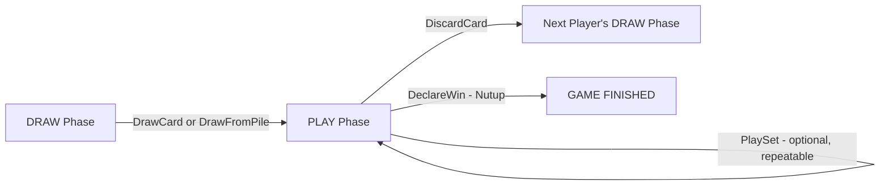

# Remi Game — Detailed Rules & Implementation Map

This document maps the **intended rules** to the **actual backend implementation** in `state.go` and `logic.go`. Use this to verify correctness.

---

## 1. Setup

| Rule | Implementation | File:Line |
|------|---------------|-----------|
| 4 players required | Empty slots filled by bots | [state.go](file:///Users/fbahesna/dev/explore/personal/remi/backend/game/state.go#L90-L100) |
| Standard 52 cards + 2 Jokers = **54 total** | `NewDeck()` generates 4suits × 13ranks + 2 Jokers | [logic.go](file:///Users/fbahesna/dev/explore/personal/remi/backend/game/logic.go#L12-L34) |
| Each card has unique UUID | `uuid.New().String()` per card | [logic.go](file:///Users/fbahesna/dev/explore/personal/remi/backend/game/logic.go#L20) |
| Deck shuffled before dealing | `Shuffle()` uses `rand.Shuffle` | [logic.go](file:///Users/fbahesna/dev/explore/personal/remi/backend/game/logic.go#L36-L44) |
| Master gets **8 cards**, others get **7** | Dealt in `StartGameUnlocked` loop | [state.go](file:///Users/fbahesna/dev/explore/personal/remi/backend/game/state.go#L108-L123) |
| Pile starts empty | `Pile = make([]Card, 0)` | [state.go](file:///Users/fbahesna/dev/explore/personal/remi/backend/game/state.go#L126) |
| Master goes first, starts in **PLAY phase** (skips draw since they have 8) | `TurnPhase = PhasePlay` | [state.go](file:///Users/fbahesna/dev/explore/personal/remi/backend/game/state.go#L136-L138) |

**Card distribution**: 8 + 7 + 7 + 7 = 29 cards dealt. 54 − 29 = **25 cards in deck**.

---

## 2. Turn Flow

Each turn follows: **DRAW → PLAY → DISCARD**

### 2a. DRAW Phase — `DrawCard()` or `DrawFromPile()`

> [!IMPORTANT]
> The player **MUST** draw exactly once. After drawing, phase transitions to PLAY.

#### Option A: Draw from Deck (`DrawCard("DECK", 1)`)
- Takes top card from deck → adds to hand
- If deck is empty → game ends immediately (Status = FINISHED, no winner)
- **Result**: Hand grows by 1 card. Phase → PLAY.

| Check | Code |
|-------|------|
| Game in progress | `Status != StateInProgress` → error |
| Correct player | `idx != CurrentTurnPlayer` → error |
| Draw phase | `TurnPhase != PhaseDraw` → error |
| Deck not empty | `len(Deck) == 0` → game over |

#### Option B: Draw from Pile (`DrawCard("PILE", count)`)
- Takes last `count` cards (1-3) from pile → adds ALL to hand
- **Restriction**: `CanFormSetWithMultiple(hand, drawnCards)` must be true
- **Result**: Hand grows by `count` cards. Phase → PLAY.

| Check | Code |
|-------|------|
| Count ≤ 3 | `count > 3` → error |
| Enough cards in pile | `len(Pile) < count` → error |
| Drawn cards must form a set with hand | `CanFormSetWithMultiple()` → error |

#### Option C: Pile Pick (`DrawFromPile(handCardIDs, pileCardID)`)
- Player selects 2+ cards from hand + 1 card from last 3 of pile
- Combined cards must form a valid set (`IsValidSet`)
- Set is **immediately played to table** (not added to hand)
- Hand cards used are **removed from hand**
- **Result**: Hand shrinks by N cards. Phase → PLAY.

| Check | Code |
|-------|------|
| At least 2 hand cards selected | `len(handCardIDs) < 2` → error |
| Pile card exists | `pileIdx == -1` → error |
| Pile card in last 3 | `pileIdx < pileLen-3` → error |
| Combined = valid set | `!IsValidSet(combined)` → error |

---

### 2b. PLAY Phase — `PlaySet()` (Optional, Repeatable)

Player may play 0 or more sets from hand to the table.

| Check | Code |
|-------|------|
| Play phase | `TurnPhase != PhasePlay` → error |
| Cards form valid set | `!IsValidSet(cards)` → error |
| Player owns all cards | Checked via ID lookup |

**Effect**: Selected cards removed from hand, added to `PlayedSets` and `TableSets`.

---

### 2c. DISCARD Phase — `DiscardCard(cardID)`

Player **MUST** discard exactly 1 card to end their turn.

| Check | Code |
|-------|------|
| Not draw phase | `TurnPhase == PhaseDraw` → error |
| Card exists in hand | `cardIdx == -1` → error |

**Effect**: Card removed from hand → added to Pile. Turn advances to next player. Next player starts in DRAW phase.

---

### 2d. Declare Win — `DeclareWin()` (Nutup)

> [!CAUTION]
> **Current checks in `DeclareWin`:**
> 1. Game in progress
> 2. It's the player's turn (`idx == CurrentTurnPlayer`)
> 3. `IsWinningHand(hand)` returns true
>
> **Missing check: No phase validation!** DeclareWin does NOT check `TurnPhase`. A player could technically Nutup during DRAW phase (before drawing). The frontend restricts this (`turnPhase !== 'DRAW'`), but the backend does not enforce it.

#### `IsWinningHand(hand)` Logic
1. If hand ≤ 1 card → **true** (trivial win)
2. Try `canPartition(hand)` — can ALL cards form valid sets with 0 leftovers?
3. Try removing each card one at a time → `canPartition(remaining)` — can all EXCEPT 1 form valid sets?
4. If any succeeds → **true** (the removed card is the "discard")

#### `canPartition(cards)` Logic
- Recursive: picks `cards[0]`, tries every subset of remaining cards to form a valid set with it
- If valid set found, recursively partitions the leftover
- **Exponential time** but hand size is small (≤ 8)

#### Example: Hand = `[Joker, Joker, Q♣, J♣, K♣]`
- Remove Joker₁ → `canPartition([Joker₂, Q♣, J♣, K♣])`
  - First = Joker₂, rest = [Q♣, J♣, K♣]
  - Try subset {Q♣, J♣, K♣} + Joker₂ = `IsValidSet([Joker, Q♣, J♣, K♣])` → **TRUE** (run J-Q-K with Joker extending)
  - Remaining = [] → `canPartition([])` = **TRUE** ✅
- **Result: WINNING HAND** (discard 1 Joker, play [Joker, J♣, Q♣, K♣])

---

## 3. Valid Sets — `IsValidSet()`

### Run (Sequence)
- Same suit, consecutive ranks, minimum 3 cards
- Ace can be low (A-2-3) or high (Q-K-A)
- K-A-2 wrapping is **NOT** valid

### Group (Same Rank)
- Same rank, different suits, minimum 3 cards
- **Strict**: No duplicate suits allowed

### Joker (Wildcard)
- `Suit = "J"`, `Rank = 0`
- Separated from regular cards during validation
- For runs: fills gaps between consecutive cards
- For groups: counted as extra matching card
- All-Joker sets (≥ 3) are valid

---

## 4. Scoring — `calculateScores()`

Called when game finishes (winner declares or deck empty).

| Card | Points |
|------|--------|
| 2-10 | 5 |
| J, Q, K | 10 |
| Ace | 15 |
| Joker | −250 |

- **Winner**: Score = 0
- **Losers**: Score = sum of remaining hand card values (accumulated across rounds)

---

## 5. Game End Conditions

| Condition | Trigger | Winner |
|-----------|---------|--------|
| Nutup (Declare Win) | `DeclareWin()` succeeds | Declaring player |
| Deck Empty | `DrawCard()` when `len(Deck) == 0` | No winner (scores calculated) |

---

## 6. Restart — `RestartGame()`

- Only master can restart
- Only after game is FINISHED
- Creates entirely new deck, reshuffles, redeals
- Player scores **accumulate** (not reset)
- All other state fields reset (pile, table sets, flags)

---

## 7. Known Issues & Gaps

> [!WARNING]
> ### Issue 1: DeclareWin has no Phase Check
> `DeclareWin` does not verify `TurnPhase == PhasePlay`. The frontend blocks Nutup during DRAW phase, but the backend does not enforce this. If a client sends `DECLARE_WIN` during DRAW phase, it would process.

> [!WARNING]
> ### Issue 2: WebSocket Close 1005 on Nutup
> The `ReadPump` goroutine has no panic recovery (now added). If `DeclareWin` → `calculateScores` → `BroadcastGameUpdate` causes any panic or deadlock, the WebSocket closes silently. The panic recovery and safe `SendError` have been added but require a **server rebuild and restart** to take effect.

> [!WARNING]
> ### Issue 3: No HasPlayedSet Requirement for Nutup
> In traditional Remi, a player must have "opened" (played at least one set to the table) before they can declare win. The current implementation does NOT require `HasPlayedSet == true` — a player can Nutup with a "hand win" (all sets in hand, never played to table).

> [!NOTE]
> ### Issue 4: First Player (Master) Skips Draw
> Since master gets 8 cards and starts in PLAY phase, they skip the draw phase entirely on their first turn. They must discard 1 card (going to 7). This matches Remi rules.
