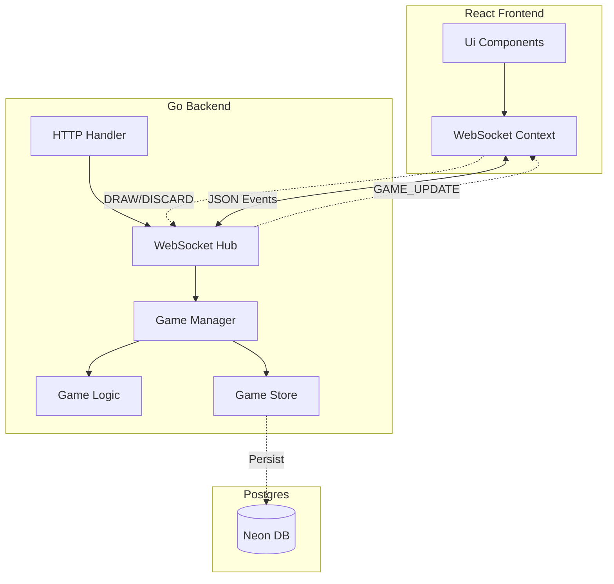

# Remi Card Game (Online Multiplayer)

A real-time 4-player card game based on Remi rules (Rummy style), built with **Go**, **React**, and **WebSockets**.

## 🎮 Game Overview

-   **Players**: 4 players (Fixed).
-   **Style**: Turn-based, real-time sync.
-   **Objective**: Form valid sets (Runs, Sets, Aces) and be the first to "Nutup" (Empty hand).

### Custom Rules
1.  **Turn Flow**: Draw -> Play Sets (Optional) -> Discard (Mandatory).
2.  **Draw Source**: Deck OR Discard Pile (Pile limited to once per game).
3.  **Win Condition**: "Nutup" - Declare win when your hand is empty after playing valid sets.

## 🏗 System Architecture

The system uses a **Client-Server** architecture with **WebSocket** for bidirectional real-time communication.



### Key Components

-   **Backend (`/backend`)**:
    -   `ws/hub.go`: Manages active connections and broadcasts state.
    -   `game/state.go`: State machine handling phases (Draw, Play, Discard).
    -   `game/logic.go`: Remi rules engine (Card ranking, Set validation).
    -   `models/`: Shared data structures.

-   **Frontend (`/frontend`)**:
    -   `WebSocketContext.tsx`: React Context for socket management.
    -   `Table.tsx`: Main game board rendering players and deck.
    -   `Hand.tsx`: Player's interactive hand.

## 🚀 Getting Started

### Prerequisites
-   **Go** 1.21+
-   **Node.js** 18+
-   **PostgreSQL** (Optional for local dev, uses in-memory/file if DB not configured, or modify `state.go` persistence).

### 1. Start Backend

```bash
cd backend
go mod tidy
go run main.go
```
*Server runs on `http://localhost:8080`*

### 2. Start Frontend

```bash
cd frontend
npm install
npm run dev
```
*App runs on `http://localhost:5173` (or `3000`)*

### 3. Verify / Simulate Players

To simulate other players (bots) for testing:

```bash
cd backend
go run cmd/client/main.go -n 3
```

## 📜 API / WebSocket Contract

**Actions (Client -> Server)**
-   `JOIN_GAME`: `{ name: "Player1" }`
-   `DRAW_CARD`: `{ source: "DECK" | "PILE" }`
-   `PLAY_SET`: `{ cards: [...] }`
-   `DISCARD_CARD`: `{ cardId: "..." }`
-   `DECLARE_WIN`: `{}`

**Events (Server -> Client)**
-   `GAME_UPDATE`: Full sanitized game state (opponents' cards hidden).
-   `ERROR`: `{ message: "..." }`


TODO:

